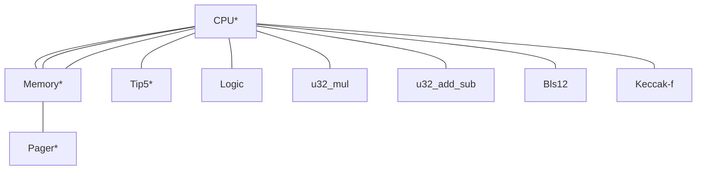

By Delendum

Github repository: [Valida](https://github.com/delendum-xyz/valida) and [Valida Compiler](https://github.com/delendum-xyz/valida-compiler)

*Our vision:* We want to make it practical to compile conventional code to a zkVM with reasonable performance. No zkVM today is optimized for this goal. We desire a VM with neither registers nor a dedicated stack, and one that has a small field size with low-degree constraints. We also want efficient compilation from LLVM IR to the set of VM instructions. 

## Architecture

The zkVM consists of a CPU and several coprocessors, which are connected with communication buses:


\* Part of the core (non-optional) configuration

Communication buses are implemented using permutation arguments (either grand product or multi-set checks), and may be multiplexed for efficiency when only one of a subset of buses will be used in a given cycle.

There are multiple VM configurations. The "Core" configuration is always present, and provides instructions for basic control flow and memory access. Additional configurations, such as "Field Arithmetic" or "Additional Jump" build upon the core configuration and offer additional instructions.  

### Instruction format

Instructions are encoded in groups of 6 field elements. The first element in the group contains the opcode, followed by three elements representing the operands and two immediate value flags: $\text{opcode}, \text{op}_a$, $\text{op}_b$, $\text{op}_c$, $\text{imm}_b$, $\text{imm}_c$. 

### Program ROM

Our VM operates under the Harvard architecture, where progrom code is stored separately from main memory. Code is addressed by any field element, starting from $0$. The program counter `pc` stores the location (a field element) of the instruction that is being executed.

### Memory

Memory is comprised of word-addressable cells. A given cell contains 4 field elements, each of which are typically used to store a single byte (arbitrary field elements can also be stored). All core and ALU-related instructions operate on cells (i.e. any operand address is word aligned -- a multiple of 4). In the VM compiler, the address of newly added local variables in the stack is word aligned.

For example, a U32 is represented in memory by its byte decomposition (4 elements). To initialize a U32 from an immediate value, we use the `SETL16` instruction (see the complete instruction list below), which sets the first two bytes in memory. To initialize a U32 value greater than 16 bits, we can also call the `SETH16` instruction to set the upper two bytes.

### Immediate Values

Our VM cannot represent operand values that are greater than the prime $p$, and cannot distinguish between $0$ and $p$. Therefore, any immediate values greater than or equal to $p$ need to be expanded into smaller values.

### Registers

Our zkVM does not operate on general purpose registers. Instead, instructions refer to variables local to the call frame, i.e. relative to the current frame pointer `fp`.

### Notation

The following notation is used throughout this document:

**Operand values**: `opa`, `opb`, `opc` denote the value encoded in the operand a, b, or c of the current instruction.

**CPU registers**: `fp`, `pc` denote the value of the current frame pointer and program counter, respectively.

**Relative addressing**: `[a]` denote the cell value at address `a` offset from `fp`, i.e. `fp + a`. Variables local to the call frame are denoted in this form. *Note that we are omitting `fp` in the expression here*, but that the first dereference of an operand is always relative to the frame pointer. 

**Absolute addressing:** `[[a]]` denotes the cell value at absolute address `[a]`. Heap-allocated values are denoted in this form.

To refer to relative or absolute element values, we use the notation $[a]_\text{elem}$ or $[[a]]_\text{elem}$ respectively.

## Instruction list

[Depending on the values of the instruction flags, operands $a$ or $b$ may be either an immediate value or memory address. In the table below we assume that these operands represent addresses. Memory values are retrieved by indexing the array $\text{mem}$.]:#

Each instruction contains 5 field element operands, $a, b, c, d, e$. Often, $d$ and $e$ are binary flags indicating whther operands $a$ and $b$ are immediate values or relative offets.

Listed below are the instructions offered in each configuration.

### Core

| Mnemonic | <div style="width:140px">Operands (asm)</div> | Description                                                                                                                                                                                                                                                                                                                                                                  |
| ----------- | --- | ----- |
| **LW** / **LOAD32**      | `a(fp), c(fp)` | Follow the pointer stored at offset $c$ from the current frame pointer and write the next 4 byte values to those beginning at offset a. Operand $b$ is unused, but is constrained to $[c]$ in the trace. LOAD32 is used to load 4 bytes from the heap, and is aligned (i.e. the address at offset $c$ is assumed to be a multiple of $4$). |
| **SW** / **STORE32**      | `b(fp), c(fp)` | Write the 4 byte values beginning at the address stroed at offset $c$ to those beginning at offset $b$. Operand $a$ is unused, but is constrained to $[c]$ in the trace. STORE32 is used to write 4 bytes to the heap, and is aligned. |
| **JAL** | `a(fp), b, c` | Jump to address and link: Store the $pc+1$ to local stack variable at offset $a$, then set $pc$ to field element $b$. Set $fp$ to $fp + c$. |
| **JALV** | `a(fp), b(fp), c(fp)` | Jump to variable and link: Store the $pc+1$ to local stack variable at offset $a$, then set $pc$ to the field element $[b]_{elem}$. Set $fp$ to $[c]$. |
| **BEQ** | `a, b(fp), c(fp)` | If $[b] = [c]$, then set the program counter $\text{pc}$ to $a$ |
| **BEQI** | `a, b(fp), c` | If $[b] = c$, then set the program counter $\text{pc}$ to $a$ |
| **BNE** | `a, b(fp), c(fp)` | If $[b] \neq [c]$, then set the program counter $\text{pc}$ to $a$ |
| **BNEI** | `a, b(fp), c` | If $[b] \neq c$, then set the program counter $\text{pc}$ to $a$ |
| **IMM32**     | `a, b, c, d, e` | Write the immediate values $b, c, d, e$ to the cell located at offset $a$.|

### Field arithmetic

| Mnemonic | <div style="width:170px">Operands (asm)</div> | Description                                                  |
| ----------- | --- | ------------------------------------------------------------ |
| **FEADD**   |     `a(fp), b(fp), c(fp)`| $d$ and $e$ are a flags denoting whether $a$ and $b$ are interpreted as an immediate or offset. Let $A = a$ if $d = 1$ and $[a]_{elem}$ otherwise. Let $B = b$ if $e = 1$ and $[b]_{elem}$ otherwise. The instruction compute $A + B$, and write the result to offset $c$         |
| **FEMUL**   |     `a(fp), b(fp), c(fp)`| $d$ and $e$ are a flags denoting whether $a$ and $b$ are interpreted as an immediate or offset. Let $A = a$ if $d = 1$ and $[a]_{elem}$ otherwise. Let $B = b$ if $e = 1$ and $[b]_{elem}$ otherwise. The instruction compute $A \cdot B$, and write the result to offset $c$ |
| **TO_FE**     | `a(fp), b(fp)` | Convert an U32, represented by 4 field elements starting at offset b, to a field element stored to the first field element at offset $a$. $a$ is assuemd to be a multiple of $4$. |
| **FROM_FE**     | `a(fp), b(fp)` | Convert a field element $[b]_{elem}$ to an U32 stored at offset a, which is assumed to be a multiple of $4$. |

Note that field arithmetic instructions only operate on the first element in a cell, which represents a field element instead of a single byte.

### U32 Arithmetic

| Mnemonic | <div style="width:170px">Operands (asm)</div> | Description  |
| ----------- | ------------- | ----------------------------------------------------------------------------------- |
| **ADD**     | `a(fp), b(fp), c(fp)` | Compute the unchecked addition of the U32 values at cell offsets $b$ and $c$ and write the sum to cell offset $a$. Note that because a full 32-bit value does not fit within one field element, we assume that values have been decomposed into 4 8-byte elements. The summed output is stored at cell offset $a$. The same limb decomposition is used for the other U32 operations listed below. |
| **ADDI**     | `a(fp), b(fp), c` | Compute the unchecked addition of the U32 variable at cell offsets $b$ and an immediate $c$, and write the sum to cell offset $a$.|
| **SUB**     | `a(fp), b(fp), c(fp)` | Unchecked subtraction |
| **SUBI**     | `a(fp), b(fp), c` | Unchecked subtraction |
| **MUL**     | `a(fp), b(fp), c(fp)` | Unchecked multiplication |
| **MULI**     | `a(fp), b(fp), c` | Unchecked subtraction |
| **DIV**     | `a(fp), b(fp), c(fp)` | Division |
| **SH{L,R}**     | `a(fp), b(fp), c(fp)` | Shift [b] left/right by [c] and write to offset $a$. |
| **SH{L,R}I**     | `a(fp), b(fp), c` | Shift [b] left/right by c and write to offset $a$. |
| **ISH{L,R}**     | `a(fp), b, c(fp)` | Shift b left/right by [c] and write to offset $a$. |
| **SLT** | `a(fp), b(fp), c(fp)` | Set local variable $a$ to $1$ if $[b] < [c]$ and $0$ otherwise. | 
| **SLT** | `a(fp), b(fp), c` | Set local variable $a$ to $1$ if $[b] < c$ and $0$ otherwise. | 
<!--| **CHECKED_ADD**     | $c$, $a$, $b$ | Checked addition |-->
<!--| **CHECKED_MUL**     | $c$, $a$, $b$ | Checked multiplication |-->

### Bitwise

| Mnemonic | Operands (asm) | Description                                                                         |
| ----------- | - | ----------------------------------------------------------------------------------- |
| **AND**     | `a(fp), b(fp), c(fp)` | Set $[a]$ to $[b]$ bitwise-and $[c]$ |
| **OR**     | `a(fp), b(fp), c(fp)` | Set $[a]$ to $[b]$ bitwise-or $[c]$ |
| **XOR**     | `a(fp), b(fp), c(fp)` | Set $[a]$ to $[b]$ bitwise-xor $[c]$ |
<!--| **ANDI**     | $a$, $b$, $c$ | $\text{OP}_{AND}$, $a$, $b_1$, $c$, $1$, $b_2$, $b_3$, $b_4$| Set $[a]$ to $[b]$ bitwise-and $c$ |
| **ORI**     | $a$, $b$, $c$ | $\text{OP}_{OR}$, $a$, $b$, $c_1$, $1$, $c_2$, $c_3$, $c_4$| Set $[a]$ to $[b]$ bitwise-or $c$ |
| **XORI**     | $a$, $b$, $c$ | $\text{OP}_{XOR}$, $a$, $b$, $c_1$, $1$, $c_2$, $c_3$, $c_4$| Set $[a]$ to $[b]$ bitwise-xor $c$ |-->

### Byte Manipulation

**Note**: These will not be supported in the initial version.

| Instruction | <div style="width:130px">Operands (asm)</div>      | |
| ----------- | ------------- | -| 
| **LOAD8**     | `a(fp), b(fp)` | Load a byte at the address specified by local variable at offset $b$ to local variable at offset $a$.|
| **STORE8**     | `b(fp), c(fp)` | Store a byte encoded at offset $c$ to the address encoded in offset $b$|
| **STORE8I**     | `b(fp), c` | Store a byte encoded in the field element $c$ to the address encoded in offset $b$|

## Heap allocation

Notes:
- Fixed configurable stack size (e.g. 8MB), growing in opposite direction of the heap.
- Allocate-only malloc (no de-allocation using `free`)

## Assembly


### Instructions

<!--
* `[c] = add [a] [b]` - Add local variables at offsets `a` and `b` and write sum to offset `c`
    * e.g. `[1] = add [2] [3]` is add with three operands, `2, 3, 1`
* `[b] = a` - Set the value of local variable at offset `b` to immediate value `a`
    * This translates to `add b, a, 0` where both `a` and `0` are immediate values
* `[b] = [[a]]` - write the memory at `[a]` to local variable at offset `b`
    * e.g. `[1] = [[2]]` this translate to a LOAD instruction with operands `2, _, 1`
* `[[b]] = [a]` - write the value of `[a]` to heap-allocated variable pointed to by local variable`b`
    * e.g. `[[1]] = [2]` this translate to a STORE instruction with operands `2, 1, _`
* `fp = [a]` - setting frame pointer to local variable `a`
* `fp = [[a]]` - setting frame pointer to heap-allocated value pointed to in local varaible `[a]`
* `sp = sp + opa` - incrementing stack pointer by immediate value opa
* `sp = sp + [opa]` - incrementing stack pointer by local variable opa
* `call a` - call program located at the value of operand a
* `call [a]` - call program located at local variable at offset `a`
* `jmpeq [a], [b], [c]` - Set `pc` to `[c]` if local varaible offsets at `a` and `b` are equal.
-->

We will closely follow RISC-V assembly, making modifications as necessary. The most important difference between our zkVM assembly and RV32IM is that instead of registers `x0-31`, we only have two special-purpose registers `fp` and `pc`. However, we have (up to $2^{31}-1$) local variables, addressed relative to the current frame point `fp`.

### Calling convention / stack frame

| Stack (grows downwards, i.e. address decreases from top row to bottom row)  |
| -------- |
| Arg 2     |
| Arg 1     |
| Return FP |
| Return value |
| Return address **(<- Current fp)** |
| Local 1     |
| Local 2     |
| ...     |
| Local N     |

We follow the RISC-V convention and grows the stack downwards. For a function call, the arguments are pushed onto the stack in reverse order. **We only allow statically sized allocation on the stack**, unlike traditional architectures where `alloca` can be used to allocate dynamically. All dynamic allocation will be compiled to heap allocations. Instead of using a frame pointer that points at the begining of the frame, we use a stack pointer which points at the first free stack cell.

Note that:
* Functions arguments are stored at fp + 12, fp + 16, ...
* Return FP (the value of FP before the call) is stored at fp+8
* Return value is stored at fp + 4
* Return address is stored at fp
* Local variables are stored at fp - 4, fp - 8, ...

### Pseudo instructions

| Pseudo Instruction | Instruction |
| -------- | -------- |
| call label | `jal 0(fp), -b, label; addifp b`, where b is size of the current stack frame plus the call frame size for instantiate a call to lable |
| ret     | `jal 4(fp), 0(fp), 0`, set pc to [fp] where the return address is stored  |

### Implementing MEMCPY/SET/MOVE

Memcpy will require rougly 2 cycles per word. We can follow [this memcpy implementation on RISC-V](https://github.com/westerndigitalcorporation/RISC-V-Linux/blob/master/linux/arch/riscv/lib/memcpy.S).

### Heap allocations

### Example programs

#### Multiply stored immediates and return

```llvm=
define i32 @main() {
  %1 = alloca i32, align 4
  %2 = alloca i32, align 4
  %3 = alloca i32, align 4
  store i32 24, i32* %1, align 4
  store i32 7, i32* %2, align 4
  %4 = load i32, i32* %1, align 4
  %5 = load i32, i32* %2, align 4
  %6 = mul nsw i32 %4, %5
  store i32 %6, i32* %3, align 4
  %7 = load i32, i32* %1, align 4
  ret i32 %7
}
```

```assembly=
main:
  sub      -4(fp), 0(fp), 0(fp)      # Setup the 0 local variable at fp - 4
  add     -8(fp), -4(fp), 24,    # Set [fp - 8] to 24
  add    -12(fp), -4(fp), 7,     # Set [fp - 12] to 7

  mul     -16(fp), 8(fp), 12(fp)    # Set [fp - 16] to 24 * 7 

  add    4(fp), -8(fp), 0     # Set return value at [fp + 4] to [fp - 8]
  ret
```

#### Multiply arguments and return

```llvm=
define i32 @main() {
  %1 = alloca i32, align 4
  store i32 0, i32* %1, align 4
  %2 = call i32 @mul(i32 938253, i32 7)
  ret i32 %2
}

define i32 @mul2(i32 %0, i32 %1) {
  %3 = alloca i32, align 4
  %4 = alloca i32, align 4
  store i32 %0, i32* %3, align 4
  store i32 %1, i32* %4, align 4
  %5 = load i32, i32* %3, align 4
  %6 = load i32, i32* %4, align 4
  %7 = mul nsw i32 %5, %6
  ret i32 %7
}
```

```c=
main: 
    imm32     -4(fp), 938253
    imm32     -8(fp), 7
    call         mul2
    # call translates to
    # jal 0(fp), -16, mul2  " store pc + 1 to [fp], add -16 to fp, set pc to mul2
    # addifp         16

    ret

mul2:
    mul    4(fp), 8(fp), 12(fp)
    ret
```
The stack at the time of executing `mul` inside `mul` (line 11) looks like:

| Stack  |
| -------- |
|  ..  **(<- fp of main)** |
| 7     |
| 938253     |
| 0 (before mul2) -> 6567771 (after mul2) |
| main:7 **(<- fp of mul2)** |

## Trace

### Main CPU

| Columns            | Configuration    | Description                                                                            |
| --------------- | --- | -------------------------------------------------------------------------------------- |
| $\text{clk}$    |  Core   | Clock cycle                                                                            |
| $\text{pc}$     |  Core   | Program counter                                                                        |
| $\text{fp}$     |  Core   | Frame pointer                                                                          |
| $\text{opcode}$ |  Core   | Instruction opcode                                                                     |
| $\text{op}_a$   |  Core   | Operand $a$                                                                            |
| $\text{op}_b$   |  Core   | Operand $b$                                                                            |
| $\text{op}_c$   |  Core   | Operand $c$                                                                            |
| $\text{op}_d$   |  Core   | Operand $d$, flag for if $\text{op}_a$ is immediate or offset.|
| $\text{op}_e$   |  Core   | Operand $e$, flag for if $\text{op}_b$ is immediate or offset.|
| $\text{addr}_a$ |  Core   | $\text{fp} + \text{op}_a$ (if $\text{op}_d$ is not set) |
| $\text{addr}_b$ |  Core   | $\text{fp} + \text{op}_b$ (if $\text{op}_e$ is not set) |
| $\text{addr}_c$ |   Core  | $\text{fp} + \text{op}_c$                                                              |

Columns $\text{opcode}, \text{op}_a, \text{op}_b, \text{op}_c, \text{op}_d, \text{op}_e$ are specified by the program code (see the "Instruction Trace" section below).

Trace cells are also allocated to hold buffered read memory values for $\text{addr}_a$ and $\text{addr}_b$, and buffered write values for $\text{addr}_c$. We read and write 4 elements from memory at a time to the main trace. These elements are only constrained when the immediate value flags are not set (see the "Instruction Decoding" section below):

| Cell            | Configuration    | Description                                                                            |
| --------------- | --- | -------------------------------------------------------------------------------------- |
| $v_{a,0}$           |   Core  | $[\text{addr}_a]_\text{elem}$|
| $v_{a,1}$           |   Core  | $[\text{addr}_a+1]_\text{elem}$|
| $v_{a,2}$           |   Core  | $[\text{addr}_a+2]_\text{elem}$|
| $v_{a,3}$           |   Core  | $[\text{addr}_a+3]_\text{elem}$|
| $v_{b,0}$           |  Core   | $[\text{addr}_b]_\text{elem}$|
| $v_{b,1}$           |  Core   | $[\text{addr}_b+1]_\text{elem}$|
| $v_{b,2}$           |  Core   | $[\text{addr}_b+2]_\text{elem}$|
| $v_{b,3}$           |  Core   | $[\text{addr}_b+3]_\text{elem}$|
| $v_{c,0}$           | Core    | Value written to $\text{addr}_c$               |
| $v_{c,1}$           | Core    | Value written to $\text{addr}_c+1$               |
| $v_{c,2}$           | Core    | Value written to $\text{addr}_c+2$               |
| $v_{c,3}$           | Core    | Value written to $\text{addr}_c+3$               |


### Memory

| Cell                     | Description |
| ------------------------ | ----------- |
| $\text{addr}$            | Address     |
| $\text{clk}$             | Clock cycle |
| $\text{val}_0$ | Value 0     |
| $\text{val}_1$ | Value 1     |
| $\text{val}_2$ | Value 2     |
| $\text{val}_3$ | Value 3     |
| $d_0$ | Lower 16 bits of $\text{clk}'-\text{clk}-1$ |
| $d_1$ | Upper 16 bits of $\text{clk}'-\text{clk}-1$ |
| $t$ | Nondeterministic inverse of $\text{addr}'-\text{addr}$ |

The memory table is sorted by ($\text{addr}, \text{clk}$)

### U32 Arithmetic

TODO: Replace this trace table and associated constraints with more efficient nondeterministic methods

| Cell                     | Description |
| ------------------------ | ----------- |
| $\text{clk}$             | Clock cycle |
| $s_\text{instr}$             | Requested instruction (constrained by communication bus) |
| $s_\text{add}$             | Selector flag for addition |
| $s_\text{sub}$             | Selector flag for subtraction |
| $s_\text{mul}$             | Selector flag for multiplication |
| $s_\text{div}$             | Selector flag for division |
| $s_\text{checked_add}$             | Selector flag for checked addition (requires $s_\text{add}$ to be set as well)|
| $s_\text{checked_mul}$             | Selector flag for checked multiplication (requires $s_\text{mul}$ to be set as well)|
| $a$             | Address of input 1 |
| $b$             | Address of input 2 |
| $c$             | Address of output |
| $a_0$             | Input 1 (12-bit limb) |
| $a_1$             | Input 1 (12-bit limb) |
| $a_2$             | Input 1 (12-bit limb) |
| $b_0$             | Input 2 (12-bit limb) |
| $b_1$             | Input 2 (12-bit limb) |
| $b_2$             | Input 2 (12-bit limb) |
| $c_0$             | Output (12-bit limb) |
| $c_1$             | Output (12-bit limb) |
| $c_2$             | Output (12-bit limb) |
| $c_3$             | Output (12-bit limb) |
| $c_4$             | Output (12-bit limb) |

There are also 5 helper value cells: $h_0$ through $h_{4}$.

### Instruction Trace

Each instruction is encoded as 6 field elements

#### Core

| Mnemonic | Operands (asm) | Encoded  |
| ----------- | --- | ---------------------------------------------------- |
| **LW** / **LOAD32**      | `a(fp), c(fp)` |  $\text{OP}_{LW}$, $a$, _, $c$, $0$, $0$ | Follow the pointer stored at offset $c$ from the current frame pointer and write the next 4 byte values to those beginning at offset a. Operand $b$ is unused, but is constrained to $[c]$ in the trace. LOAD32 is used to load 4 bytes from the heap, and is aligned (i.e. the address at offset $c$ is assumed to be a multiple of $4$). |
| **SW** / **STORE32**      | `b(fp), c(fp)` | $\text{OP}_{SW}$, _, $b$, $c$, $0$, $0$ | Write the 4 byte values beginning at the address stroed at offset $c$ to those beginning at offset $b$. Operand $a$ is unused, but is constrained to $[c]$ in the trace. STORE32 is used to write 4 bytes to the heap, and is aligned. |
| **JAL** | `a(fp), b, c` | $\text{OP}_{jump}$, $a$, $b$, $c$, $1$, $1$| Jump to address and link: Store the $pc+1$ to local stack variable at offset $a$, then set $pc$ to field element $b$. Set $fp$ to $fp + c$. |
| **JALV** | `a(fp), b(fp), c` | $\text{OP}_{jump}$, $a$, $b$, $c$, $0$, $1$| Jump to variable and link: Store the $pc+1$ to local stack variable at offset $a$, then set $pc$ to the field element $[b]_{elem}$. Set $fp$ to $fp + c$. |
| **BEQ** | `a, b(fp), c(fp)` | $\text{OP}_{branch}$, $a$, $b$, $c$, $0$, $0$ | If $[b] = [c]$, then set the program counter $\text{pc}$ to $a$ |
| **BEQ** | `a, b(fp), c` | $\text{OP}_{branch}$, $a$, $b$, $c$, $0$, $1$ | If $[b] = c$, then set the program counter $\text{pc}$ to $a$ |
| **BNE** | `a, b(fp), c(fp)` | $\text{OP}_{branch}$, $a$, $b$, $c$, $1$, $0$ | If $[b] \neq [c]$, then set the program counter $\text{pc}$ to $a$ |
| **BNEI** | `a, b(fp), c` | $\text{OP}_{branch}$, $a$, $b$, $c$, $1$, $1$ | If $[b] \neq c$, then set the program counter $\text{pc}$ to $a$ |
| **IMM32**     | `a, b, c, d, e` | $\text{OP}_{IMM}$, $a$, $b$, $c$, $d$, $e$ | Write the immediate values $b, c, d, e$ to the cell located at offset $a$.|

#### Field arithmetic

| Mnemonic | Operands (asm) | Encoded   |
| ----------- | --- | ------------- |
| **FEADD**   |     `a(fp), b(fp), c(fp)`| $\text{OP}_{FEADD}$, $a$, $b$, $c$, $d$, $e$  | $d$ and $e$ are a flags denoting whether $a$ and $b$ are interpreted as an immediate or offset. Let $A = a$ if $d = 1$ and $[a]_{elem}$ otherwise. Let $B = b$ if $e = 1$ and $[b]_{elem}$ otherwise. The instruction compute $A + B$, and write the result to offset $c$         |
| **FEMUL**   |     `a(fp), b(fp), c(fp)`| $\text{OP}_{FEMUL}$, $a$, $b$, $c$, $d$, $e$  | $d$ and $e$ are a flags denoting whether $a$ and $b$ are interpreted as an immediate or offset. Let $A = a$ if $d = 1$ and $[a]_{elem}$ otherwise. Let $B = b$ if $e = 1$ and $[b]_{elem}$ otherwise. The instruction compute $A \cdot B$, and write the result to offset $c$ |
| **TO_FE**     | `a(fp), b(fp)` | | Convert an U32, represented by 4 field elements starting at offset b, to a field element stored to the first field element at offset $a$. $a$ is assuemd to be a multiple of $4$. |
| **FROM_FE**     | `a(fp), b(fp)` | | Convert a field element $[b]_{elem}$ to an U32 stored at offset a, which is assumed to be a multiple of $4$. |

#### U32 Arithmetic

| Mnemonic | Operands (asm) | Encoded   |
| ----------- | ------------- | --|
| **ADD**     | `a(fp), b(fp), c(fp)` | $\text{OP}_{ADD}$, $a$, $b$, $c$, $0$, $0$ | Compute the unchecked addition of the U32 values at cell offsets $b$ and $c$ and write the sum to cell offset $a$. Note that because a full 32-bit value does not fit within one field element, we assume that values have been decomposed into 4 8-byte elements. The summed output is stored at cell offset $a$. The same limb decomposition is used for the other U32 operations listed below. |
| **ADDI**     | `a(fp), b(fp), c` | $\text{OP}_{ADD}$, $a$, $b$, $c_0$, $1$, $c_1$ | Compute the unchecked addition of the U32 variable at cell offsets $b$ and an immediate $c$, and write the sum to cell offset $a$.|
| **SUB**     | `a(fp), b(fp), c(fp)` | $\text{OP}_{SUB}$, $a$, $b$, $c$, $0$, $0$ | Unchecked subtraction |
| **SUBI**     | `a(fp), b(fp), c` | $\text{OP}_{SUB}$, $a$, $b$, $c_1$, $1$, $c_2$ | Unchecked subtraction |
| **MUL**     | `a(fp), b(fp), c(fp)` | $\text{OP}_{MUL}$, $a$, $b$, $c$, $0$, $0$| Unchecked multiplication |
| **MULI**     | `a(fp), b(fp), c` | $\text{OP}_{MUL}$, $a$, $b$, $c_1$, $1$, $c_2$ | Unchecked subtraction |
| **DIV**     | `a(fp), b(fp), c(fp)` | $\text{OP}_{MUL}$, $a$, $b$, $c$, $0$, $0$| Division |
| **SH{L,R}**     | `a(fp), b(fp), c(fp)` | $\text{OP}_{SHIFT}$, $a$, $b$, $c$, $0$, $0$| Shift [b] left/right by [c] and write to offset $a$. |
| **SH{L,R}I**     | `a(fp), b(fp), c` | $\text{OP}_{SHIFT}$, $a$, $b$, $c$, $0$, $1$| Shift [b] left/right by c and write to offset $a$. |
| **ISH{L,R}**     | `a(fp), b, c(fp)` | $\text{OP}_{SHIFT}$, $a$, $b$, $c$, $0$, $1$| Shift b left/right by [c] and write to offset $a$. |
| **SLT** | `a(fp), b(fp), c(fp)` | $\text{OP}_{SLT}$, $a$, $b$, $c$, $0$, $0$| Set local variable $a$ to $1$ if $[b] < [c]$ and $0$ otherwise. | 
| **SLT** | `a(fp), b(fp), c` | $\text{OP}_{SLT}$, $a$, $b$, $c$, $0$, $1$| Set local variable $a$ to $1$ if $[b] < c$ and $0$ otherwise. | 
<!--| **CHECKED_ADD**     | $c$, $a$, $b$ | Checked addition |-->
<!--| **CHECKED_MUL**     | $c$, $a$, $b$ | Checked multiplication |-->

### Bitwise

| Mnemonic | Operands (asm) | Encoded    |
| ----------- | - | ------------- |
| **AND**     | `a(fp), b(fp), c(fp)` | $\text{OP}_{AND}$, $a$, $b$, $c$, $0$, _| Set $[a]$ to $[b]$ bitwise-and $[c]$ |
| **OR**     | `a(fp), b(fp), c(fp)` | $\text{OP}_{OR}$, $a$, $b$, $c$, $0$, _| Set $[a]$ to $[b]$ bitwise-or $[c]$ |
| **XOR**     | `a(fp), b(fp), c(fp)` | $\text{OP}_{XOR}$, $a$, $b$, $c$, $0$, _| Set $[a]$ to $[b]$ bitwise-xor $[c]$ |
<!--| **ANDI**     | $a$, $b$, $c$ | $\text{OP}_{AND}$, $a$, $b_1$, $c$, $1$, $b_2$, $b_3$, $b_4$| Set $[a]$ to $[b]$ bitwise-and $c$ |
| **ORI**     | $a$, $b$, $c$ | $\text{OP}_{OR}$, $a$, $b$, $c_1$, $1$, $c_2$, $c_3$, $c_4$| Set $[a]$ to $[b]$ bitwise-or $c$ |
| **XORI**     | $a$, $b$, $c$ | $\text{OP}_{XOR}$, $a$, $b$, $c_1$, $1$, $c_2$, $c_3$, $c_4$| Set $[a]$ to $[b]$ bitwise-xor $c$ |-->


### Instruction decoding

Trace cells are also allocated for each selector. In each cycle, the opcode is decoded into the following selector flags, which are grouped by type (not configuration) below for convenience. All flags are binary values, except for the instruction code.

#### Instruction code

| Selector         | Configuration    | Description      |
| ---------------- | --- | ---------------- |
| $s_\text{instr}$ | Core    | Instruction code |

#### Operand modifiers

| Selector           | Configuration    | Description                                                                            |
| ------------------ | --- | -------------------------------------------------------------------------------------- |
| $s_{\text{imm}_a}$ | Core    | Immediate value flag for operand $a$ ($0$ denotes offset, $1$ denotes immediate value) |
| $s_{\text{imm}_b}$ | Core    | Immediate value flag for operand $b$ ($0$ denotes offset, $1$ denotes immediate value) |


#### Field arithmetic

| Selector    | Configuration    | Description    |
| -------------- | --- | -------------- |
| $s_\text{add}$ | Field Arithmetic    | Addition       |
| $s_\text{mul}$ | Field Arithmetic    | Multiplication |

#### Memory

| Selector        | Configuration    | Description                                |
| ------------------ | --- | ------------------------------------------ |
| $s_\text{store32}$ |  Core   | Store 4 bytes at at a memory address |
| $s_\text{load32}$  |  Core   | Load 4 bytes from a memory address |
| $s_\text{store8}$ |  Core   | Store a byte at a memory address |
| $s_\text{load8}$  |  Core   | Load a byte from a memory address |

#### Call

| Selector     | Configuration    | Description |
| --------------- | --- | ----------- |
| $s_\text{call}$ | Core     |  Update the frame pointer            |

#### Jumps

| Selector         | Configuration    | Description                        |
| ------------------- | --- | ---------------------------------- |
| $s_\text{jump_eq}$  | Core    | Jump equal flag                    |
| $s_\text{jump_neq}$ | Additional Jumps    | Jump not equal flag                |
| $s_\text{jump_ge}$  | Additional Jumps   | Jump greater than or equal to flag |
| $s_\text{jump_lt}$  | Additional Jumps    | Jump less than flag                |

#### U32 arithmetic

| Selector                | Configuration    | Description |
| -------------------------- | --- | ----------- |
| $s_\text{u32_add}$         | U32 Arithmetic |             |
| $s_\text{u32_sub}$         | U32 Arithmetic |             |
| $s_\text{u32_mul}$         | U32 Arithmetic |             |
| $s_\text{u32_div}$         | U32 Arithmetic |             |
| $s_\text{u32_checked_add}$ | U32 Arithmetic |             |
| $s_\text{u32_checked_mul}$ | U32 Arithmetic |             |

#### Binary operations

| Selector                | Configuration    | Description |
| -------------------------- | --- | ----------- |
| $s_\text{bitwise_and}$         | Bitwise |             |
| $s_\text{bitwise_or}$         | Bitwise |             |
| $s_\text{bitwise_xor}$         | Bitwise |             |

[| Bits 1-8        | Bit 9 | Bit 10 | Bit 11 | Bit 12 | Bits 17-32    |]:#
[| --------------- | ----- | ------ | ------ | ------ | ------------- |]:#
[| $f_\text{opcode}$ | $f_d$ | $f_{\text{op}_a}$  | $f_{\text{op}_b}$  | $f_{\text{op}_c}$]:#

[where the binary flag $f_{\text{op}_x}$ for $x \in \{a,b,c\}$ determines whether $\text{op}_x$ is an address ($0$) or immediate value ($1$).]:#

<!--

## State transition

**Note: This state transition is outdated, and may not reflect what is written above.**

```python
addr_a = op_a + fp
addr_b = op_b + fp
addr_c = op_c + fp

# Read value a
if s_imm_a == 1:
    v_a = op_a
else:
    v_a = mem[addr_a]

# Read value b
if s_imm_b == 1:
    v_b = op_b
else:
    v_b = mem[addr_b]

# Instruction selection
if s_call == 1:
    fp = addr_a;
    mem[addr_c]
elif s_add == 1:
    mem[addr_c][0] = o_c = v_a + v_b
elif s_mul == 1:
    mem[addr_c][0] = o_c = v_a * v_b
elif s_u32_add == 1:
    mem[addr_c] = u32_add(v_a, v_b)
elif s_u32_mul == 1:
    mem[addr_c] = u32_mul(v_a, v_b)
elif s_u32_checked_mul == 1:
    mem[addr_c] = u32_checked_mul(v_a, v_b)
elif s_u32_checked_add == 1:
    mem[addr_c] = u32_checked_add(v_a, v_b)
elif s_jump_eq == 1:
    pc_next = pc + addr_c

if s_jump_eq == 0 and s_jump_neq == 0 and
   s_jump_gt == 0 and s_jump_le == 0:    
    pc_next = pc + 1
```

## Constraints

**Note: These constraints are outdated, and may not reflect what is written above. All constraints will be of max degree 3.**

### Main CPU

#### Instruction decoding

To decode selectors from $\text{opcode}$, we first decode $\text{opcode}$ into binary opcode flags $f_i$ for $i \in 0,...,N$, where $N$ is the total number of flags. 

$\sum_{i=0}^{N} 2^i \cdot f_i - \text{opcode} = 0$

We then define constraints relating the binary opcode flags to the selectors (not shown), as well as the following flags to ensure that all flags are binary, and that only one instruction is active in each cycle:

$f_i \cdot (1 - f_i) = 0,\quad i \in 0,...,N$

$s_i \cdot (1 - s_i) = 0,\quad i \in 0,...,M$

$\sum_{i \in \{\text{instr}\}} s_{i} = 1$

Finally, we define the following constraint for the single instruction selector: 

$s_\text{instr} = \sum_{i=0}^M 2^i \cdot s_i$

TODO: We need to copy the opcode and operands from memory into the main trace. Should this be read from the read-write memory or a separate read-only memory? If from the main read-write memory, then we'll need a second memory communication bus.

#### Program counter

$(1-s_\text{jump_eq}-s_\text{jump_neq}-s_\text{jump_lt}-s_\text{jump_ge}) \cdot (\text{pc}' - \text{pc} - 1) + \\
s_\text{jump_eq} \cdot \Big((\text{pc}' - c) + (v_a-v_b) \Big)= 0$

#### Frame pointer

$\text{addr}_a - \text{fp} - \text{op}_a = 0$

$\text{addr}_b - \text{fp} - \text{op}_b = 0$

$\text{addr}_c - \text{fp} - \text{op}_c = 0$

TODO: Define constraint relating frame pointer and stack pointer

#### Jumps

$s_\text{jump_eq} \cdot (v_\text{a,i} - v_\text{b,i}) = 0,\quad i \in {0,...,C}$

#### Field arithmetic

$s_\text{mul} \cdot (v_\text{a,0} \cdot v_\text{b,0} - v_\text{c,0}) = 0$

$s_\text{add} \cdot (v_\text{a,0} + v_\text{b,0} - v_\text{c,0}) = 0$

### Memory

#### Non-contiguous read-write memory

$(\text{addr}' - \text{addr} - 1)\cdot (\text{clk} - \text{clk} - 1 - d_0 - 2^{16} \cdot d_1) = 0$

TODO: Define constraint allowing non-contiguous addresses 

### Communication buses

We have two communication buses. One that handles communication between the CPU and memory, and one that handles communication between the CPU and all coprocessors.

#### Main CPU communication bus

To read $v_a$ and $v_b$ from memory and write $v_c$ to memory (with $C$ value components), we use a single permutation column: $b_\text{mem}^\text{cpu}$. These operations require constraints to be specified on each side of the bus.

- CPU trace constraints:
  
  $u^\text{cpu}_{\text{mem}} = \gamma_0 + \gamma_1\cdot\text{clk} + \gamma_2\cdot\text{addr}_x + \sum_{i=0}^{C}\gamma_{i+3}\cdot v_{x,i}$
  
  $v^\text{cpu}_\text{mem} = \gamma_0 + \gamma_1\cdot\text{clk} + \gamma_2\cdot\text{addr}_x + \sum_{i=0}^{C}\gamma_{i+3}\cdot v_{c,i}$
      
  $b^{\text{cpu}'}_\text{mem} \cdot \prod_{x\in\{a,b\}} \big((1-\text{imm}_x) \cdot u^\text{cpu}_{\text{mem},x}  + \text{imm}_x\big) -  b^{\text{cpu}}_\text{mem} \cdot v^\text{cpu}_\text{mem} = 0$
  
  *Note: The above constraint is currently degree 4. If we have memory values read at every cycle (regardless of whether an immediate value is present), then we can reduce this to degree 3.*
- Memory trace constraints:

  $v^\text{cpu}_\text{mem} = \gamma_0 + \gamma_1\cdot\text{clk} + \gamma_2\cdot\text{addr} + \sum_{i=3}^{3+C}\gamma_i\cdot\text{val}_i$
  
  $b^{\text{cpu}'}_\text{mem} - b^{\text{cpu}}_\text{mem} \cdot v^\text{cpu}_\text{mem} = 0$

  *Note: Up to three rows need to be added in the memory table at each cycle, one for each read value, and one for the written value.*

#### Coprocessor communication bus

To send input to and receive output from other coprocessors, we use a single permutation column $b_\text{cpu}$. These operations require constraints to be specified on each side of the bus.

  - CPU trace constraints: 
  
    $u^\text{u32}_\text{cpu} = \gamma_0 + \gamma_1\cdot\text{clk} + \gamma_2\cdot\text{addr}_a + \gamma_3\cdot\text{addr}_b \\\quad\quad + \sum_{i=0}^{2} \gamma_{4+i} \cdot v_{a,i} +\sum_{i=0}^{2} \gamma_{7+i} \cdot v_{a,i} + \gamma_{10} \cdot s_\text{instr}$
    
    $v^\text{u32}_\text{cpu} = \gamma_0 + \gamma_1\cdot\text{clk} + \gamma_2\cdot\text{addr}_c + \sum_{i=0}^{2} \gamma_{2+i} \cdot v_{c,i} + \gamma_{10} \cdot  s_\text{instr}$
    
    $(s_\text{coproc} - \text{U32}) \cdot (b_{\text{cpu}}^{'} \cdot v^\text{u32}_{\text{mem},c} - b^{\text{u32}}_\text{mem} \cdot u^\text{u32}_{\text{mem},a}) = 0$
    
    *Note: $s_\text{coproc}$ is a trace cell indicating the target coprocessor. $s_\text{instr}$ is a trace cell indicating the instruction. $\text{U32}$ is a fixed constraint value.*

  - U32 trace constraints:
    
    $u^\text{cpu}_\text{u32} = \gamma_0 + \gamma_1\cdot\text{clk} + \gamma_2\cdot c + \sum_{i=0}^{2} \gamma_{2+i} \cdot c_{i} + \gamma_{6} \cdot s_\text{instr}$
    
    $v^\text{cpu}_\text{u32} = \gamma_0 + \gamma_1\cdot\text{clk} + \gamma_2\cdot a + \gamma_3\cdot b + \sum_{i=0}^{2} \gamma_{4+i} \cdot a_{i} +\sum_{i=0}^{2} \gamma_{7+i} \cdot b_{i} + \gamma_{10} \cdot s_\text{instr}$
    
    $b_\text{cpu} \cdot v^\text{cpu}_\text{u32} - b_\text{cpu} \cdot u^\text{cpu}_\text{u32} = 0$


### U32 Arithmetic

TODO: Specify constraints to decode $s_\text{instr}$ into appropriate selector flags (sum, multiply, etc).

We need to perform range checks on the input?

#### Multiplication
$s_\text{mul} \cdot (a_0 \cdot b_0 - c_0 - 2^{12} h_0) = 0$
$s_\text{mul} \cdot (a_0 \cdot b_1 + a_1 \cdot b_0 + h_0 - c_1 - 2^{12} h_1) = 0$
$s_\text{mul} \cdot (a_0 \cdot b_2 + a_1 \cdot b_1 + a_2 \cdot b_0 + h_1 - c_2 - 2^{12} h_2) = 0$
$s_\text{mul} \cdot (a_1 \cdot b_2 + a_2 \cdot b_1 + h_2 - c_3 - 2^{12} h_3) = 0$
$s_\text{mul} \cdot (a_2 \cdot b_2 + h_3 - c_4 - 2^{12} h_4) = 0$

#### Checked multiplication

$s_\text{checked_mul} \cdot (c_3 + c_4) = 0$

#### Addition

$s_\text{add} \cdot (a_0 + b_0 - c_0 + 2^{12} h_0) = 0$
$s_\text{add} \cdot (a_1 + b_1 + h_0 - c_1 + 2^{12} h_1) = 0$
$s_\text{add} \cdot (a_2 + b_2 + h_1 - c_2 + 2^{12} h_2) = 0$

#### Checked addition

$s_\text{checked_add} \cdot h_2 = 0$

-->


## Design notes

<!--
No zkVM today is optimized for this goal:
- Miden is a stack-based VM with a large instruction set, but it does not have an associated compiler that supports high-level programming language. It is unclear whether the choice of instructions are optimal for generating code from LLVM or WASM. While it makes different design decisions, these same issues apply to the Triton VM.
- Risc0 is a VM that decodes and processes RISC V instructions. It faces the opposite problem of Miden. While it can leverage the RISC V toolchain to run compiled programs from most high-level languages, the instruction set is not optimized for the unique considerations of a zkVM, and execution traces for generic computation are longer as a result. 
-->

### Frontend target

We are writing a compiler from LLVM IR to our ISA

### ZK stack

This is a STARK-based zkVM. We are using [Plonky3](https://github.com/Plonky3/Plonky3) to implement the polynomial IOP and PCS.

<!--
This will be a STARK-based zkVM. Since speed is paramount here, ideally it would use "Plonky3", which doesn't exist yet. We should probably start with something like Winterfell or Starky, which are available now. We should consider writing constraints in a DSL such as AirScript, so that we can switch to "Plonky3" (or whatever is fastest) in the future.
-->

### Field choice

We plan to use the 32-bit field defined by `p = 2^31 - 1`, which should give very good performance on GPUs or with most vector instruction sets.

<!--
However, we may start with the Goldilocks field since it's already supported by libraries like Winterfell. We will write constraints in a way that's compatible with both, assuming only `p ≥ 2^31 - 1`.
-->

### Registers

Our VM has no general purpose registers, since memory is cheap.

<!--

We will need a program counter register, and may also want multiple registers to hold pointers to memory.

TODO: Are carry/overflow flags useful for wasm?
-->


### Memory

We will use a conventional R/W memory.


### Tables

The CPU can do up to three memory operations per cycle, to support binary operations involving two reads and one write.

If we used a single-trace model, we could support this by adding columns for 6 memory operations in each row of our trace: 3 for the chronological memory log and 3 for the `(address, timestamp)` ordered memory log.

Instead, we make the memory a separate table (i.e. a separate STARK which gets connected with a permutation argument). We also use multi-table support to implement other coprocessors that are wasteful to include in the main CPU, as their operations may not be used during most cycles (e.g. Keccak).

<!--
A single-table STARK would be simpler, and works fine for simple VMs like Cairo or Miden. But we might want to go multi-table if we want the VM to be extensible, with optional acceleration of various hashes etc.
-->


### Continuations

TODO: Explain the permutation-based continuation implementation.


### Lookups

Initially, we will support lookups only against prover-supplied tables. The main use case is range checks. To perform a 16-bit range check, for example, we would have the prover send a table containing `[0 .. 2^16 - 1]` in order. (If the trace was not already 2^16, we would pad it. If it was longer than 2^16, the prover would include some duplicates.) We would then use constraints to enforce that this table starts at 0, ends at 2^16 - 1, and increments by 0 or 1.

Preprocessed tables can also be useful, particularly for bitwise operations like xor. However, we will not support them initially because they require non-succinct preprocessing. 


### Floating point arithmetic

Fast floating point arithmetic doesn't seem important for our anticipated use cases, so we will convert float operations to integer ones during compilation.

## Call for collaboration

This open-source project aims to construct a robust, versatile system optimized for wide-ranging use cases, performance, and development productivity. We seek varied perspectives, innovative ideas, and unwavering dedication to quality.

Your contribution can take many forms, each equally valuable. Here are a few ways you can get involved:

- Code Contribution: You can directly contribute to the source code. This could range from fixing bugs and improving documentation, to developing new features.

- Adding Coprocessors: Valida zkVM is designed to be flexible and extensible. If you have an idea for a new coprocessor that could enhance zkVM's functionality, we encourage you to design and implement it.

- Contributing to Plonky3: As part of our ongoing efforts, we are working on the Plonky3 backend. Whether you have experience in this area or are interested in learning more, your contribution can significantly help us expedite our progress.

- Code Review and Bug Reporting: Reviewing our codebase and reporting any issues you find is a great way to contribute to the project.

- Documentation: Comprehensive and clear documentation is the backbone of any successful open-source project. If you have a knack for writing or explaining complex concepts in a simple way, your skills would be greatly valued.

We are looking forward to your contributions and are ready to provide guidance and support to anyone who wants to get involved. Please visit our GitHub page to get started and feel free to reach out with any questions or ideas. 

__________________________________

_If you’re interested in further discussions on this topic or working together on this subject, please consider joining our [group chat](https://t.me/+9WAAmCpPRadjOTNh) or reach out to us at research@delendum.xyz._


